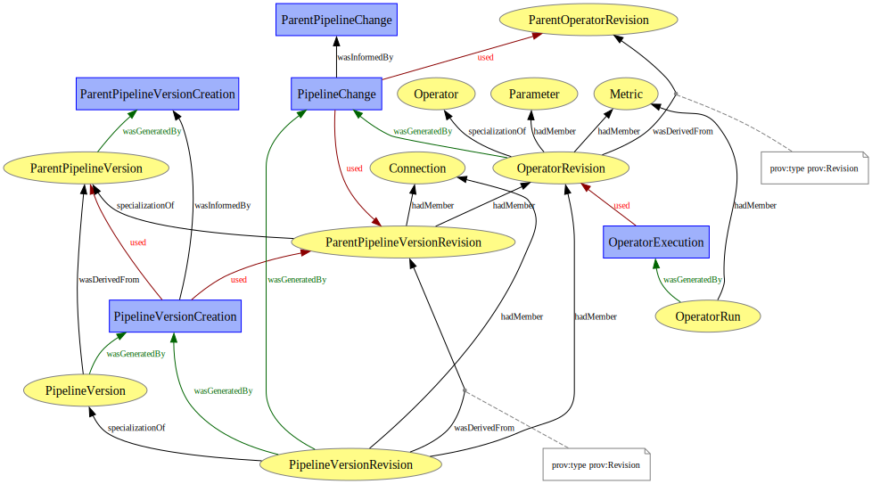
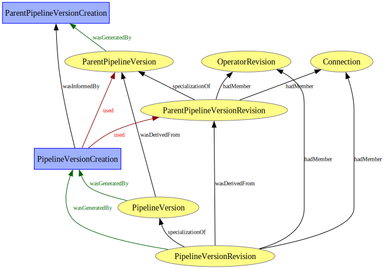
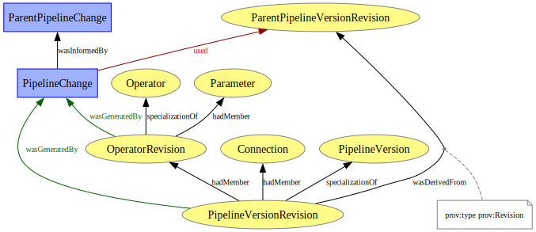
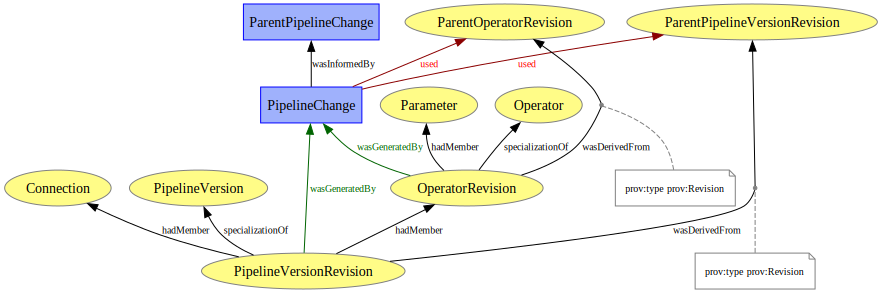
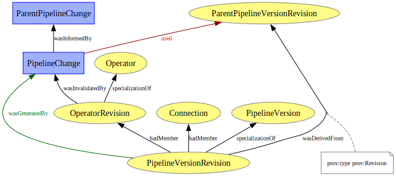
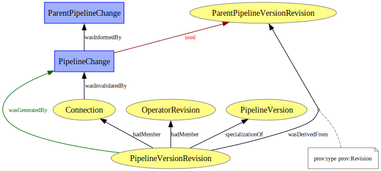
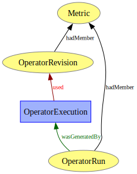

# Provenance Models

## Model Overview

The provenance model of ProvInspector consists of multiple submodels, that capture pipeline execution and evolution traces:

1. **Pipeline Version Creation Model**:
2. **Operator Creation Model**:
3. **Operator Modification Model**:
4. **Operator Deletion Model**:
5. **Connection Creation Model**:
6. **Connection Deletion Model**:
7. **Operator Execution Model**:

## Pipeline Version Creation Model

## Operator Creation Model

## Operator Modification Model

## Operator Deletion Model

## Connection Creation Model

## Connection Deletion Model

## Operator Execution Model

